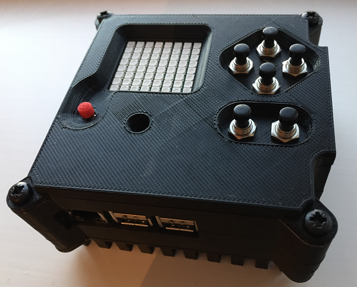

## Introduction
The Astro Pi flight case is one of the most sought-after cases in the history of the Raspberry Pi. In this resource, you will learn how to 3D print your own case and install the Astro Pi hardware inside it. You'll then have your very own Astro Pi flight unit, identical in almost every way to the ones on the International Space Station right now.

If you're participating in an Astro Pi competition, this is a great way to prototype and efficiently test your code in the same way as it would be used by the crew of the ISS.

You can follow the video tutorial of this resource [here](https://www.youtube.com/embed/zmJOA6WzfZw){:target="_blank"}.

<iframe width="560" height="315" src="https://www.youtube.com/embed/zmJOA6WzfZw" frameborder="0" allowfullscreen></iframe>

### What you will make

Here is an example of how your finished 3D-printed Astro Pi flight case might look:

### What you will learn
By following this resource you will learn how to:

- 3D print the Astro Pi flight case
- Correctly install the Astro Pi hardware inside the case

This project covers elements from the following strands of the [Raspberry Pi Digital Making Curriculum](http://rpf.io/curriculum){:target="_blank"}:

+ [Use manufacturing techniques and tools to create a completed product](https://curriculum.raspberrypi.org/manufacture/developer/){:target="_blank"}
