# 3D printed Astro Pi flight case

- [Back to 3D printing and setup](worksheet.md)

When you're happy with the 3D-printed parts you can proceed with installing the hardware.

## Fold the camera ribbon

Getting the camera into the case can be a little tricky but here is how we did it for the flight units. Firstly, lift the two tabs on either side of the camera module to disconnect the ribbon cable from the camera. Then fold the ribbon. These folds allow the camera cable to come up the side of the Raspberry Pi with enough flex to insert into the CSI camera port (see further down).

1. Lay the ribbon out with the writing face up and the visible connectors on the left. At 1cm along the ribbon, fold the ribbon downwards.

  

2. Now measure 4cm from the top of the ribbon and fold the ribbon to the right.

  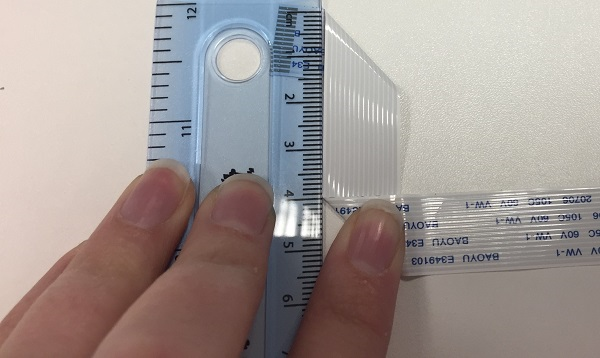

3. Finally, measuring 4cm from the bottom left corner, fold the ribbon upwards.

  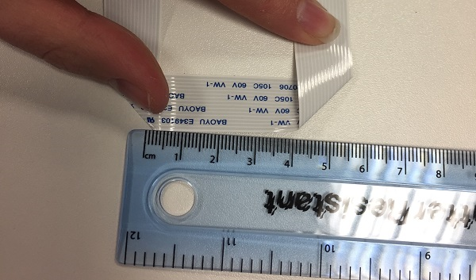

4. Tape the ribbon on the bottom to prevent it from unfurling. We have used kapton tape but any kind of tape will work fine.

  

You don't need to get this perfect for it to work, but try to get it as close as possible.

## Install the camera

Reconnect the **Cam** end of the ribbon cable to the camera module. Make sure that the tin connectors are facing the front and the blue tab is on the back.

Before proceeding, line the camera module up with the support pillar pilot holes and have a look through the aperture in the base to check the alignment of the lens. The lens block of the camera module is actually glued in position at the factory, and therefore its alignment can vary slightly from camera to camera. If you find you've got an alignment issue, you should be able to manipulate the lens block between finger and thumb before you install it into the case permanently.

When you're happy, use the small black M2 cross-head screws to install the camera module. The screws will cut their own thread in the support pillar pilot holes, but after a few turns you'll probably need a small screwdriver to continue.


Stop turning as soon as the head of the screw touches the camera module; if you tighten the screw too much it can cause the support pillar to split horizontally along the grain of the print. Furthermore, try to avoid removing and re-threading the screws as this will cut a new thread and, if done repeatedly, will erode the inside of the support pillar so that the screws will not hold.

## Install the Raspberry Pi

Firstly, ensure there's no residual scaffolding material around the SD card slot or LED holes that might prevent the Raspberry Pi from lining up with the mounting pillars. Once you're happy, line the Raspberry Pi up and do a fit check. Verify that it doesn't touch the camera module below it. Don't insert the camera ribbon cable just yet, as this will make the next job awkward.

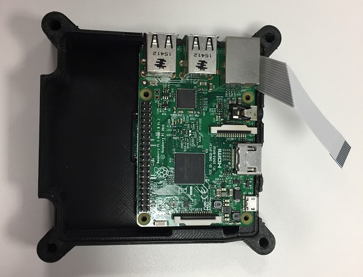

Next screw the M2.5 11mm stand offs into each corner of the Pi. With some light finger pressure they will cut their own thread in the support pillar pilot holes. After a few turns you'll need to use a small pair of pliers to continue turning them. It's possible to get these to go in at a slight angle, which can lead to alignment issues with the Sense HAT later on, so do your best to make sure they go into the support pillars as straight as possible. Be careful while you do this and, again, stop turning as soon as the stand off touches the Raspberry Pi to avoid splitting the pillars horizontally along the grain of the print.

If you are having trouble screwing the stand offs in, screw one of the silver M2.5 cross head screws into the stand off, then use the screw head to screw the stand off into the case. Once the stand off is in place, don't forget to remove the screw.


You can now insert the camera ribbon cable into the CSI port of the Raspberry Pi. Try to make sure the tin connectors are all level to ensure a good connection.

## Install stand offs for the Sense HAT

This is where we're going to deviate from what's inside the Astro Pi flight unit. The flight units have another circuit board in between the Raspberry Pi and Sense HAT which holds a real-time clock, an oscillator crystal, and a backup battery. This RTC board also has some pins that the six push-buttons connect to. Unfortunately, this is not available to the public.

Our goal was to keep the 3D-printed flight case as faithful to the original as possible, so the decision was taken to not alter it to accommodate the absence of this board. It may be possible for us to release the Gerber files for it in the future so that people can make their own. We're going to use hex nuts of the same depth as the RTC board to compensate for its absence.

Add the extended 23-way pin header to the Raspberry Pi GPIO pins, at the furthest end from the USB ports. Then, take an 8mm M2.5 stand off and put a hex nut onto its thread before screwing it into the hole of the 11mm stand off, as shown below. Do the same for the remaining three stand offs.

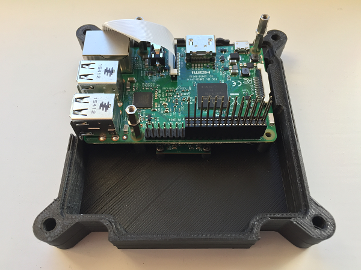

WARNING|&nbsp;
---|---
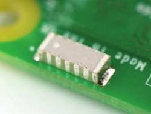|A note for Pi 3 users. Using a **metal** stand off next to the wireless antenna will degrade its performance and range. The advice is to either omit this stand off from your build or to use a nylon stand off and nylon screw instead.

Do not install the Sense HAT yet as it will get in the way when you connect the GPIO pins to the buttons.

## Install the push-buttons

This section assumes you are using the buttons from the Astro Pi [components kit](http://cpc.farnell.com/ucreate/uc-apk-comp1/astro-pi-component-kit-budget/dp/SC14158) from CPC. If you are using the APEM buttons or another type of button, these may differ in their installation.

Take a button, then unscrew and remove the nut. Sometimes the nut will get stuck on the button cap, but it should come off if you wiggle it.


Keeping the washer on the thread, insert the button from the underside of the lid. Then on the top side of the lid, put the nut back on and tighten it with your fingers. Check that the connectors are aligned horizontally on the underside before tightening fully.

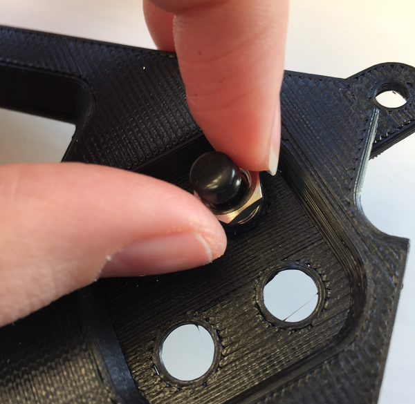

Do the same for the remaining buttons; when you are done it should look like this:


If you are using the lid with the pilot holes then you'll need to check the datasheet for your chosen button type to find the **threaded bushing diameter**. Once you know this you can select a drill bit with this diameter, plus 1mm for clearance, and proceed to drill all six holes. We recommend using a vice or G clamp to hold the lid in place while you drill. You can then install the buttons as per their requirements.

## Create the button wires

Firstly you need to prepare the button wires to be able to attach them to the buttons. In the real flight unit, we soldered the button wires on to make them more reliable, but in the kit you will find jumper wires which will do the same job. The colour of the wires is not important as they are all exactly the same inside.

Take a coloured wire and, without cutting it, remove the black plastic sheath from **one** end. You can do this by pulling it off with wire cutters or by pulling up the small tab and removing it by hand. This exposes a pin connector. 

Pass a plastic insulation boot over the pin connector, narrow end first, and slide it out of the way down the wire. Then place the connector inside a crimp. 


Alternating the angle of your pliers, squash the crimp around the wire until there is no movement whatsoever of the pin connector within the crimp. Then slide the insulation boot back up over the wire and crimp. Repeat this six times with the other coloured jumper wires to create the wires we will connect to the six buttons.

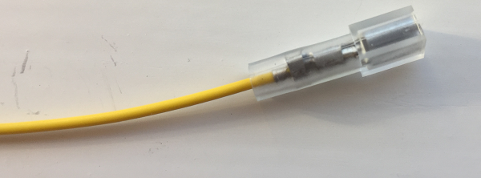

## Create a ground wire loop

To avoid having six more wires connected to the Raspberry Pi as ground wires, you will create a ground loop wire which connects to all of the buttons; this technique is also used in the real flight units. 

Take the piece black wire, which should be approximately 50cm in length. Using a ruler and wire cutters, make five 10cm lengths. For each length, use wire strippers to expose at least 1cm of bare wire on both ends, then bend the wire into a U shape.

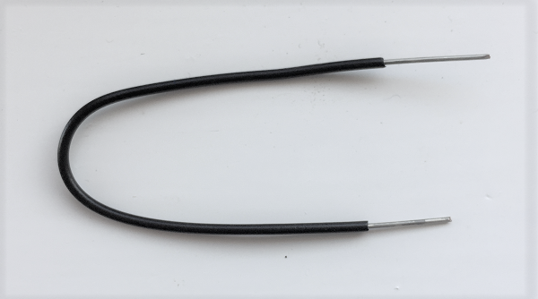

Now take a black jumper wire and remove the black plastic sheath from one end to expose the connector, just as you did before. Hold the connector next to the end of one of your 10cm lengths of black wire, and pass both wires through the narrow end of an insulation boot. Insert both wires together into a crimp and tighten the crimp as before.


Connect up the four remaining lengths of black wire to create a chain, crimping together a new wire with the exposed bare end of the previous wire. You will be left with one bare wire end as in the photograph below.


For the final end, use pliers to fold the bare wire over to make it twice as thick before putting this wire alone inside a crimp and tightening up as before. You should end up with a chain containing six crimped ends and one black plastic jumper end.

## Connecting wires to the button terminals

First you will connect your ground loop to the buttons. Starting with the top button, take the crimped wire end furthest from the black plastic jumper lead. Slide the insulation boot down, hold the crimp between finger and thumb and push it all the way onto the button terminal. Once the crimp is firmly in place, slide the insulation boot back up. Repeat to attach one of the black ground wire connections to each of the six buttons.


Now take the coloured wires you made earlier and connect one crimped end to the spare terminal of each button, using exactly the same method.

## Connecting the buttons to the Raspberry Pi

Fit the middle section of the Astro Pi case onto the base. You should do this now as the GPIO wires will prevent it from being fitted later.

Now you are going to wire the buttons to the free GPIO pins at the bottom of the header. Turn the Astro Pi case so that the Ethernet and USB ports are at the bottom, and the GPIO pins are on the right of the Raspberry Pi.


The pins marked in red are where you will wire up the buttons, with the bottom of the diagram being the pins closest to the USB ports. 

Look at the **UNDERSIDE** of the lid, with the buttons on the left and the display hole on the right. Connect the coloured wire from each button to the corresponding pin below:

- Top four buttons
    - Top: GPIO 26
    - Bottom: GPIO 13
    - Left: GPIO 19
    - Right: GPIO 20
- Bottom pair of buttons
    - Left: GPIO 21
    - Right: GPIO 16

Finally, connect the ground wire to either pin 34 or 39 (labelled Ground on the GPIO diagram). 

The lid will now be a bit awkward until we finish, but try to position it gently so it is not in the way.

The picture below is of one of the flight units that went into space. On the right, you can see the base of the RTC board with the connector pins for the buttons. If you look at the button contacts on the left, you'll see we used only one black ground wire that went from button to button.

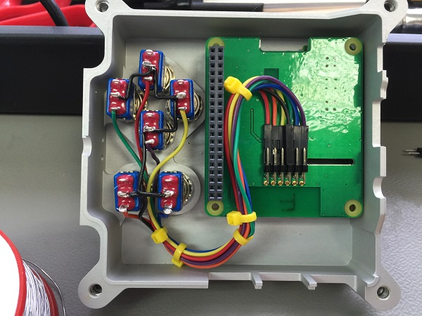

## Install the Sense HAT

Remove the GPIO connector that comes with the Sense HAT; wiggle it from side to side and it will come off without too much force. The Sense HAT can then be inserted onto the extended header. Note that these pins should not protrude through the top of the Sense HAT. If they do, then the height is not correct.

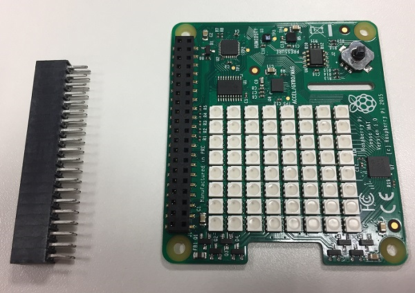

Finally, use the M2.5 cross-head screws to secure the Sense HAT to the stand offs below.

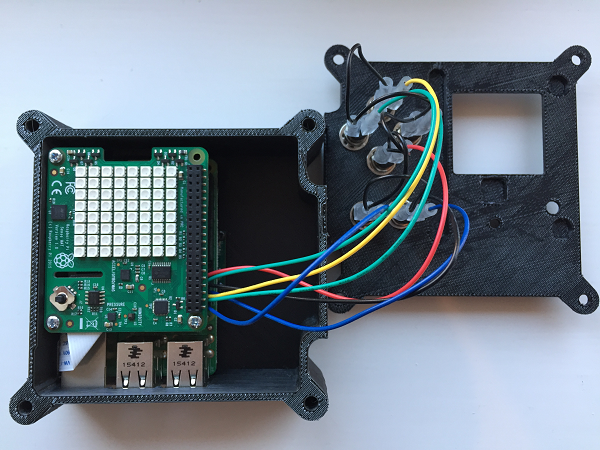

## Assemble the case

Once you're happy that the internals of the case are complete, you can proceed to the final assembly stage. 

Take the lid and gently tuck the wires into the space on the right of the Pi as neatly as you can. Place the lid on top of the case and align the heat sink on the bottom.

Take the black M4 threaded bolts and insert one through each of the holes in the corners of the case. Inserting all four bolts at this stage will help to line everything up and make it easier to secure the case with the nuts.

Take one of the large hex nuts and with your index finger place it against the bottom of the bolt. Push the bolt back up so that the nut is then flush with the bottom of the case and turn the head of the nut with your finger and thumb so that it catches the bolt thread. Tighten the nut with your fingers only. 


Once all four nuts are in place you can do a final tighten with a screwdriver.

Your Astro Pi is almost complete; the last thing to do is install your 3D-printed joystick hat by pressing it onto the joystick. For this, the real flight units use a track point cap from a Lenovo ThinkPad laptop!


## Test the buttons

Once you have assembled the Astro Pi, start it up with a monitor, keyboard, and mouse connected.

If you have the ESA-branded Astro Pi kit, when you turn the Astro Pi on, the rainbow pattern on the LED matrix should disappear after a few seconds and the push buttons should now type letters. You can test this in the terminal by running the test program at the bottom of this section.

If you do not have the ESA-branded Astro Pi kit, when you turn the Astro Pi on, the rainbow pattern on the LED matrix will remain and the buttons will not work yet.

You will need to download some files and change a few configuration settings, so make sure your Astro Pi is online. Firstly, download the Device Tree overlay that maps the push buttons to the corresponding keyboard keys. 

Open a terminal window and enter these commands:

```bash
cd /boot/overlays
sudo wget https://github.com/raspberrypilearning/astro-pi-flight-case/raw/master/dtb/astropi-keys.dtbo --no-check-certificate
```

Type `ls` and check that the file `astropi-keys.dtbo` is now showing in the list of files.

Next, we need to configure `config.txt` to load this overlay:

```bash
sudo nano /boot/config.txt
```

Go to the bottom of the file and enter the line below:

```bash
dtoverlay=rpi-sense
dtoverlay=astropi-keys
```

Press `Ctrl - O` then `Enter` to save, followed by `Ctrl - X` to quit.

Now reboot the Astro Pi.

```bash
sudo reboot
```

Now let's download and run a Python test program to check everything is working. The test code uses [Pygame](http://pygame.org/wiki/tutorials), so please do this on a directly connected monitor. It will not work via remote access. Open a terminal window and enter these commands:

```bash
cd ~
wget https://github.com/raspberrypilearning/astro-pi-flight-case/raw/master/test_code/pygame_test.py --no-check-certificate
chmod +x pygame_test.py
./pygame_test.py
```

Wiggle the joystick and press all push-buttons. If everything is working, the joystick should give a direction indication and the buttons will show the corresponding letter on the LED matrix. Press `Escape` to exit.


## What next?

We've deliberately not shown a really polished gorgeous case, because we're hoping you'll go the extra mile and blow our socks off. Please show us your cases by tweeting pictures of them to `@astro_pi` and `@raspberry_pi`!

Here are some further ideas:

- Use metallic grey spray paint
- Use sandpaper to create the matt finish that the bead-blasted aluminium flight cases have
- Engrave decals into the case
- Use different colours of filament for each part

The STL files are released under the Creative Commons attribution [licence](http://creativecommons.org/licenses/by-sa/4.0/) so you are welcome to modify them. Please note that GitHub has a great [STL viewer](https://github.com/blog/1465-stl-file-viewing) and also has a [3D file diff](https://github.com/blog/1633-3d-file-diffs), which could be useful for tracking your changes.

But by far the greatest benefit of owning an Astro Pi flight unit is the ability to prototype and test code that could be run on the International Space Station. Head over to the [Astro Pi website](https://astro-pi.org/) now to get involved!
